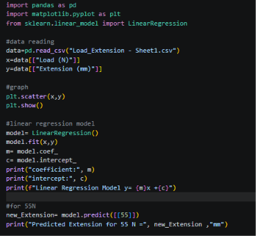

# Assignment1-linear-regression
Assignment 1 about Linear Regression submitted by Mithra Nandhana B A. 

## Problem Statement
A mechanical engineer is analyzing the relationship between the applied load on a spring and the extension produced. Using the dataset given below, build a Simple Linear Regression model to study the relationship between load and extension.

## Answer
Below,
1. The Numerical projection of Simple Linear Regression and the slope(m) and y-intercept(c)
2. Representation using y=mx+c
3. Prediction of Extension in mm at Load 55 N

`assignment1-linear-regression/numerical/`

And, implementation of the same is done using python. The code is saved in the `assignment1-linear-regression/assignment/` along with the csv file containing the data and the code.
The code and the output along with graph are given below.

## *Code*

## *Output*

## *Linear Regression Graph*

